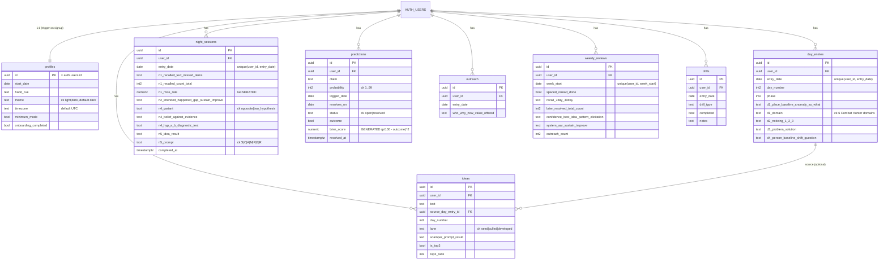
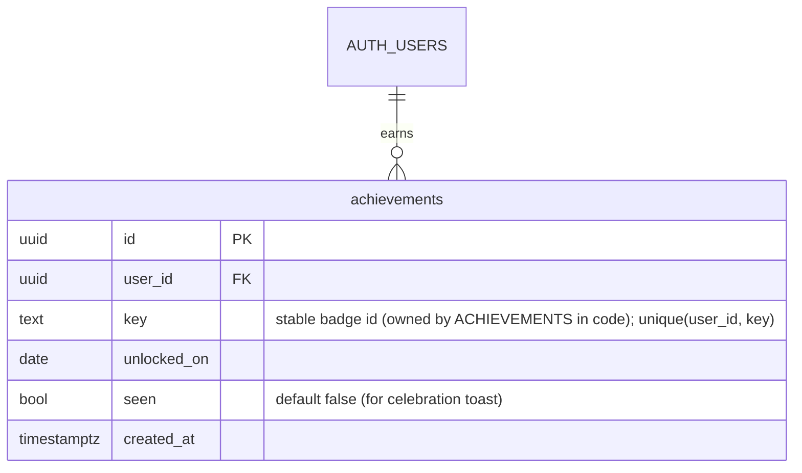

# 66-Day System — Database Schema

The Supabase Postgres data model. **Implemented by** `supabase/migrations/0001_init.sql`.
Every table has **RLS enabled** and is scoped to its owner; reference content (reading list,
citations, drills, roadmap copy) lives in code (`lib/static/`), not the database.

## Entity-relationship diagram

> Column names in the diagram are grouped for readability (e.g. `d1_place_baseline_anomaly_so_what`
> = `d1_place`, `d1_baseline`, `d1_anomaly`, `d1_so_what`). The migration is the exact source.

## Row-Level Security

RLS is **enabled on all 8 tables**. Policies:

- `profiles` — select/insert/update where `auth.uid() = id`.
- All other tables — select/insert/update/delete where `auth.uid() = user_id`
  (insert uses `with check`). Generated by a `DO` loop in the migration.

A `profiles` row is auto-created by the `handle_new_user()` trigger (SECURITY DEFINER) on
`auth.users` insert; onboarding fills `start_date` + `habit_cue` and flips `onboarding_completed`.

## Indexes

`day_entries(user_id, entry_date desc)`, `night_sessions(user_id, entry_date desc)`,
`predictions(user_id, status, resolves_on)`, `outreach(user_id, entry_date desc)`,
`ideas(user_id, lane)`, `weekly_reviews(user_id, week_start desc)`. Unique constraints
enforce one day-entry / night-session per `(user_id, entry_date)` and one review per `(user_id, week_start)`.

## Stored vs. computed

- **Generated columns:** `predictions.brier_score`, `night_sessions.n1_miss_rate`.
- **Computed in TypeScript** (`lib/domain/`): current day-number + phase (from `start_date` and
  the user's timezone), the "never miss twice" streak + heatmap, calibration bins, Brier/miss-rate
  weekly trends, idea-funnel counts. `day_number`/`phase` are also snapshotted onto rows at write time.
- **Timezone:** `entry_date` and "today" are computed in the user's `profiles.timezone`, never server UTC.

## Gamification additions — Tier 1 (`0002_gamification.sql`)

Designed in [`specs/gamification.md`](./specs/gamification.md). The solo tier adds **one table**;
Craft Points, ranks, and **streak freezes are all DERIVED** (in `lib/domain/gamification.ts`) — nothing
else is stored, consistent with the rest of the app. Freezes = `min(2, weeklyReviewCount)` minus those
consumed by the streak walk, so they are ungameable and can never become a paid "streak repair".

- **RLS:** owner-only `select/insert/update/delete` where `auth.uid() = user_id` (same pattern as the
  core tables). Index `achievements(user_id)`.
- **Rows are append-mostly:** inserted once when a milestone is first reached (idempotent via the unique
  constraint) and never deleted by the app (removing earned rewards harms via loss aversion).
- **Tier 2 (social, not yet migrated):** `profiles.display_name` + `profiles.show_on_leaderboard`
  (opt-in), a `buddy_connections` table, and a `SECURITY DEFINER` `leaderboard_week()` RPC that exposes
  only opted-in users' display name + weekly CP. See the spec.
