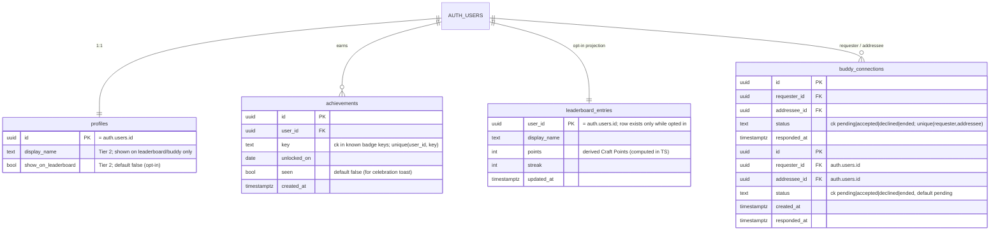

> **Evidence archive:** the full verified research (citations, votes, sentiment, caveats) lives in
> [`gamification-research.md`](./gamification-research.md) so it never has to be re-gathered.
> **Tier 1 (solo) is implemented** by `supabase/migrations/0002_gamification.sql` + `lib/domain/gamification.ts`
> (+ tests), `lib/queries/gamification.ts`, `lib/actions/gamification.ts`, and `components/game/*`.
> **Tier 2 (opt-in social) is implemented** by `supabase/migrations/0003_social.sql` (leaderboard_entries,
> buddy_connections, two SECURITY DEFINER functions), `lib/queries/social.ts`, `lib/actions/social.ts`,
> and `components/social/CohortView.tsx` at the `/leaderboard` route ("Cohort"). Both migrations must be
> applied to Supabase.

# 66-Day System — Gamification & Engagement (Healthy-by-Default)

> **Status: draft.** This is the design + data model + build plan for adding points,
> achievements, forgiving streaks, an opt-in leaderboard, and opt-in cooperative buddy
> streaks on top of the existing app. **No code is written from this spec until it is
> reviewed and flipped to `status: approved`.** It builds on the *existing* "never miss
> twice" streak (`lib/domain/streak.ts`) and the phase model (`lib/domain/phases.ts`) —
> it extends them, it does not replace them.

## 0. The one design rule (from the evidence)

> **Mechanics that affirm competence, autonomy, and relatedness — and that *celebrate*
> progress — help. Mechanics that create contingent payoffs, deadlines, threats, or
> loss-pressure *undermine* the very motivation a self-improvement app exists to build.**

Every decision below is a consequence of that rule. The app's existing streak (a single
missed day keeps the streak alive; two consecutive misses reset) is already on the right
side of it. We keep that philosophy and make it the spine of the whole system.

---

## 1. Research synthesis

Two research passes were run. **Pass A (theory/evidence)** completed and was adversarially
verified (25 claims, 0 refuted). **Pass B (real user sentiment + dark-pattern/addiction
risk)** was **halted early to conserve budget** — its sources were fetched but not all
individually verified, so Part B items are labelled `[User-reported]` / `[Practitioner-endorsed]`
and flagged as *not adversarially verified*. Treat Part A as high-confidence and Part B as
directional. Evidence labels follow the canonical doc's convention.

### 1A. Evidence (verified against primary sources)

| # | Finding | Label | Source (date) |
|---|---------|-------|---------------|
| E1 | Build for the 3 SDT needs — **competence, autonomy, relatedness**; thwarting them lowers motivation *and* wellbeing. | Confirmed by research | Ryan & Deci, *American Psychologist* 55(1):68-78 (2000) |
| E2 | **Expected tangible rewards contingent on behavior UNDERMINE intrinsic motivation** (engagement-contingent d≈−0.40, completion d≈−0.36, performance d≈−0.28); **positive/verbal feedback enhances it** (d≈+0.31). | Confirmed by research (magnitude debated) | Deci, Koestner & Ryan, *Psych. Bulletin* 125(6), 128 experiments (1999) |
| E3 | **Threats, deadlines, directives, pressured evaluation, imposed goals also diminish** intrinsic motivation; choice & self-direction enhance it. → indicts anxiety countdowns, punitive loss, coercive notifications. | Confirmed by research | Ryan & Deci (2000), p.70 verbatim |
| E4 | **Positive/competence-affirming feedback beats punitive framing** (negative vs positive g≈−0.37); competence only motivates when paired with autonomy. | Confirmed by research | Ryan & Deci (2000); Fong et al., *Educ. Psych. Review* (2019) |
| E5 | Gamification "works" — **qualified yes**; effects are context- & user-dependent, often *partial*, and can fade (novelty effect). Removing earned points/badges can *harm* engaged users (loss aversion). | Confirmed by research | Hamari, Koivisto & Sarsa, HICSS-47 (2014); Koivisto & Hamari, *IJIM* 45 (2019) |
| E6 | Effect sizes: cognitive **g=.49**, motivational **g=.36**, **behavioral g=.25** — and under high methodological rigor the **behavioral effect loses significance**. The outcome a habit app needs most is the smallest & least stable. | Confirmed by research | Sailer & Homner, *Educ. Psych. Review* 32 (2020) |
| E7 | **Specific elements → specific effects.** Badges + leaderboards + progress graphs → *competence*; avatars + story + teammates → *relatedness*. **Combining competition WITH collaboration** and game-fiction are particularly effective. | Confirmed by research | Sailer et al., *Computers in Human Behavior* 69, RCT N=419 (2017); Sailer & Homner (2020) |
| E8 | 66 days is the **median** to 95% automaticity, range **18–254** — an average, not a guarantee. | Confirmed by research | Lally et al., *Eur. J. Social Psych.* (2010) |
| E9 | Automaticity follows a **diminishing-returns curve** — early reps matter most → **front-load support** (maps to Phase 1, days 1–14). | Confirmed (curve) / Reasonable inference (design) | Lally et al. (2010) |
| E10 | **Missing one day does not derail habit formation** → forgiving streaks (grace/freeze) are evidence-backed; punitive resets are not. (Caveat: tested *single* misses only.) | Confirmed (single miss) / Reasonable inference (grace design) | Lally et al. (2010) |
| E11 | **Fogg B=MAP** — behavior needs Motivation + Ability + Prompt to converge; make the action tiny, prompt well, *celebrate* completion. | Practitioner-endorsed / definitional | BJ Fogg, behaviormodel.org |
| E12 | **Goal-gradient & endowed-progress** effects are real (pre-filled "head start" → faster completion). **⚠️ But these are commercial loyalty mechanics that work via extrinsic pull — in direct tension with E2/E3. Use as autonomy-supportive progress *visualization*, never coercive payoff.** Goal-gradient weakens under low autonomy (Hu et al. 2021). | Confirmed (mechanism) / Reasonable inference (app use) | Kivetz, Urminsky & Zheng, *J. Marketing Research* (2006); Nunes & Drèze, *JCR* (2006) |
| E13 | **Implementation intentions** ("if-then" plans) raise goal achievement, **d≈0.65** (medium-large). The app already uses this as the `habit_cue`. | Confirmed by research | Gollwitzer & Sheeran (2006) — also cited in the canonical doc |

### 1B. User sentiment & ethical-risk (directional — verification halted)

What users **love** `[User-reported]`:
- Streaks/visible progress create momentum and identity ("I'm someone who shows up"); the
  daily "don't break the chain" pull is genuinely motivating *while it lasts*.
- Celebration / competence feedback feels good; badges that mark *real* milestones are valued.
- Cooperative/social accountability (a buddy who shows up too) builds belonging.

What users **hate** — the **failure modes to design AROUND** `[User-reported / Practitioner-endorsed]`:
- **F1 — Streak anxiety & loss-rage.** Long streaks become a source of dread; breaking one
  (often to a bug, timezone, or one busy day) produces grief and "why bother now" abandonment.
  *Sources fetched:* Decision Lab "Streak-creep" (2024); networkcultures.org "Baby please don't
  break the streak" (2026-01-19); Smashing Magazine "Designing a Streak System" (2026-02).
- **F2 — The streak replaces the goal.** People optimize for *the number*, doing the minimum /
  gaming it, learning nothing. *Sources:* dev.to "Duolingo's shallow learning trap"; Medium
  "How Duolingo makes me feel guilty (and why that works)".
- **F3 — Guilt & manufactured obligation**, esp. social streaks (Snapchat) — they become a chore
  and a social *debt*, not a relationship. *Sources:* screenwiseapp "Snapchat streaks & social
  obligation"; evolvetreatment "Snapchat streaks & addicted teens".
- **F4 — Leaderboard toxicity:** cheating/bots, demotion/relegation anxiety, sandbagging,
  stress; competition-only ranking demotivates the middle and bottom.
- **F5 — Pay-to-restore-streak resentment.** Paywalling streak repair / freezes reads as
  manipulation and breeds distrust.
- **F6 — Notification spam & manufactured urgency** ("your streak ends in 2 hours!") — classic
  dark patterns (Brignull / *deceptive.design*; UX Mag "Gamification or Manipulation"; Wikipedia
  "Dark pattern"). Reads as coercive (violates E3).
- **F7 — ADHD / variable-life users** punished by rigid daily streaks; all-or-nothing resets are
  especially harmful. *Source:* helloklarity "Why streak features fail ADHD users".
- **F8 — Variable-ratio reward risk.** Unpredictable/random rewards (Skinner-box loot) drive
  compulsion. *Avoid entirely* — we give **deterministic** competence feedback, never random payoffs.

### 1C. Where evidence and sentiment AGREE / DISAGREE
- **Agree:** Forgiving streaks (E10 ↔ F1/F7), celebration over punishment (E4 ↔ F1), cooperation
  over pure competition (E7 ↔ F4), no manipulation/urgency (E3 ↔ F6).
- **Disagree / tension:** Loss-aversion streak pressure and goal-gradient countdowns *increase
  short-term engagement* (commercially proven, E12) but *erode intrinsic motivation* (E2/E3) and
  *anger users* (F1/F5/F6). **We resolve this in favor of intrinsic motivation + trust:** progress
  is *shown*, never *threatened*; nothing is ever paywalled.

---

## 2. Design decision — "Quiet Competence"

A calm, journal-native progression layer that mirrors the work you actually did, celebrates it,
and never pressures you. Chosen over (a) a classic XP/loot/leaderboard arcade (fails E2/E8/F1–F8)
and (b) doing nothing (leaves the verified competence/relatedness levers unused).

### Solo tier (Tier 1 — build first; highest confidence, no privacy surface)

1. **Craft Points (CP)** — *competence mirror, not a currency.* **Derived** deterministically from
   the work already stored (no new write path → ungameable, always consistent, no "balance" to
   chase). CP is *shown* as a reflection of effort, never spent, never required to unlock content.
   - Daytime capture sections (D1–D4): small CP each (the 5-min rep).
   - Night session completed: larger CP (the 30–45-min deep work).
   - Prediction logged / resolved: CP (rewards the calibration skill, not the outcome).
   - Weekly review completed: CP + banks a streak freeze (see #2).
   - *Framing:* "Craft Points reflect the work you've put in." No store. No leaderboard *requirement*.
2. **Forgiving streak + earned freeze.** Keep "never miss twice" + grace exactly as-is. **Add an
   *earned, never-purchasable* streak freeze:** completing a weekly review banks **1 freeze (cap 2)**.
   A freeze auto-absorbs a single missed day so the existing grace isn't consumed. **No countdown
   timers, no "you'll lose it tonight" messaging.** (Directly answers F1, F5, F7; backed by E10.)
3. **Achievements / badges** — *competence milestones tied to the real methodology* (answers F2 by
   rewarding depth, not a number). Persisted with `unlocked_on` + `seen`. Examples mapped to phases:
   | Key | Trigger | Phase |
   |---|---|---|
   | `first_light` | first day entry | 1 |
   | `night_owl` | first completed night session | 1 |
   | `seven_days` | 7-day streak | 1 |
   | `phase_2`…`phase_5` | reach each phase | 2–5 |
   | `comeback` | resume after a miss without breaking the streak | any |
   | `calibrated` | 10 predictions resolved | 3+ |
   | `forecasters_edge` | mean Brier < 0.15 over ≥10 resolved | 4+ |
   | `idea_developed` | first idea moved to `developed` / first top-3 | 3+ |
   | `reviewer` / `month_of_sundays` | 1st / 4th weekly review | 2+ |
   | `automaticity` | reach day 66 (program complete) | 5 |
   *Note (E5):* badges, once earned, are **never removed** (removal harms via loss aversion).
4. **Completion celebration** (E11/E4) — a brief, dismissible toast on completing the day / unlocking
   a badge. **Reduced-motion aware** (no animation when `prefers-reduced-motion`). No sound by default.
5. **Endowed-progress onboarding** (E12, used *honestly*) — the 66-cell journey shows setup as a
   credited first step ("you've started"), framing the journey as momentum, **not** a countdown to a
   finish line. Day 66 is presented as the program's *average* (E8), not "habit unlocked."
6. **Engagement loop = the existing `habit_cue` (E13, d≈0.65) + one gentle, user-timed daily prompt
   + celebration.** **No variable-ratio rewards (F8), no spam, no urgency (F6).**

### Social tier (Tier 2 — BUILT; privacy-sensitive, opt-in)

7. **Opt-in leaderboard** — **default OFF.** Privacy-safe: exposes only `display_name` + total
   CP/streak for users who opted in; **never** entry content or email. Implemented as a denormalised
   `leaderboard_entries` projection — presence in the table *is* the opt-in (opting out deletes the
   row), and CP is computed in TypeScript (single source of truth) and upserted, so the SQL never
   duplicates the point weights. **Constructive framing** (E7): one global board, ranked by CP, **no
   leagues, no demotion/relegation drama, no ranking notifications** (answers F4). *(Design note: total
   CP rather than week-scoped — simpler and safe given the program is finite; weekly windowing is a
   future option.)*
8. **Opt-in cooperative buddy streak** — **default OFF**, invite-by-buddy-ID → accept. Shared streak =
   consecutive calendar days *both* completed (`sharedStreak`), framed cooperatively ("you both showed
   up"), **no guilt/debt language**, and either party can end it anytime (answers F3). A buddy can read
   only the *dates* the other completed (via the `buddy_completion_dates` SECURITY DEFINER function,
   gated on an accepted connection) — **never** journal content. Builds relatedness (E7) without
   Snapchat-style obligation.

---

## 3. Data model

Additions to the schema in [`db-schema.md`](../db-schema.md). All new tables **RLS-enabled**;
solo-tier tables are scoped to the owner exactly like the existing 8 tables. Social-tier objects
deliberately allow *narrow, opt-in* cross-user reads and are documented as such.

**Tier 1 (`0002`):** only the `achievements` table — **streak freezes are DERIVED** (see below), so no
`profiles` columns are needed for the solo tier. **Tier 2 (`0003`):** two `profiles` opt-in columns,
`leaderboard_entries` (a public projection — no journal content), `buddy_connections`, and two
`SECURITY DEFINER` functions (`buddy_summary`, `buddy_completion_dates`).

**Derived, NOT stored (computed in `lib/domain/gamification.ts`):**
- **Craft Points** — pure function over existing `day_entries`, `night_sessions`, `predictions`,
  `weekly_reviews`. No table (ungameable, always consistent).
- **Shared buddy streak** — derived from both users' completion sets; no cache table.
- **Leaderboard rows** — produced by RPC, not stored.

**RLS:**
- `achievements` — select/insert/update/delete where `auth.uid() = user_id` (matches existing pattern;
  `seen` is the only field the client updates).
- `buddy_connections` — select/update where `auth.uid() IN (requester_id, addressee_id)`; insert with
  `auth.uid() = requester_id`. Each side can read the pair; neither can read the other's *entries*.
- `profiles` leaderboard read — a `SECURITY DEFINER` function `leaderboard_week()` returns
  `display_name` + weekly CP **only for rows where `show_on_leaderboard = true`**; base-table RLS
  stays owner-only (no broad profile read policy).

**Streak-freeze decision (resolved → DERIVED).** Freezes are **not stored**. Available freezes =
`min(2, completedWeeklyReviewCount)` minus those historically consumed by the streak walk — computed
in `lib/domain/gamification.ts` + `lib/domain/streak.ts`. This is ungameable, needs no mutable column,
matches the app's derive-everything philosophy (day-number, phase, streak, heatmap are all derived),
and is **structurally impossible to ever paywall** — the strongest possible answer to failure mode F5.
A freeze is *spent only to avert a reset* (a 2nd consecutive miss); isolated single misses are still
covered for free by the existing grace, so freezes are never wasted.

---

## 4. Acceptance criteria (Given/When/Then)

**Craft Points (E2-safe framing)**
- *Given* a user has completed D1 and a night session today, *when* the dashboard loads, *then* CP
  equals the deterministic sum of those sections' point values and is labelled as reflecting work done
  (no "spend"/"buy" affordance anywhere).
- *Given* the same entries are re-read, *when* CP is recomputed, *then* the value is identical (pure/idempotent).
- *Given* a user edits a past entry, *when* CP recomputes, *then* it never double-counts a section.

**Forgiving streak + freeze (E10, F1, F5, F7)**
- *Given* a 7-day streak and a completed weekly review, *when* freezes are computed, *then* the user
  has 1 banked freeze (cap 2).
- *Given* the user misses exactly one past day and has ≥1 freeze, *when* the streak is computed, *then*
  the streak is preserved, one freeze is consumed, and grace is *not* spent.
- *Given* any miss, *when* the UI renders, *then* there is **no countdown timer and no loss-threat copy**.
- *Given* `prefers-reduced-motion`, *when* a celebration fires, *then* no animation plays.

**Achievements (E4, E5, F2)**
- *Given* a user reaches a milestone (e.g. 10 resolved predictions), *when* `syncAchievements()` runs,
  *then* the `calibrated` badge is inserted once with today's `unlocked_on` and `seen=false`.
- *Given* a badge is already unlocked, *when* sync runs again, *then* no duplicate row is created and the
  badge is **never removed**.
- *Given* newly-unlocked badges, *when* the user views them, *then* a celebration toast shows and `seen`
  flips to true.

**Leaderboard (opt-in, privacy — F4, F6)**
- *Given* a user has **not** opted in, *when* `leaderboard_week()` runs, *then* their row is absent.
- *Given* any leaderboard response, *when* inspected, *then* it contains only `display_name` + score —
  no email, no entry content.
- *Given* the leaderboard, *when* rendered, *then* there is no relegation/demotion mechanic and no
  ranking notification.

**Buddy streak (opt-in, cooperative — F3)**
- *Given* user A invites user B, *when* B accepts, *then* a connection is `accepted` and both can see the
  shared streak (days both completed) but neither can read the other's entries.
- *Given* a missed shared day, *when* rendered, *then* copy is cooperative ("you both showed up on N
  days"), never guilt/debt framing; either party can end the connection.

**Accessibility & responsiveness (all features)**
- Keyboard-operable; WCAG-AA contrast using existing `--accent`/`--text` tokens; respects
  `prefers-reduced-motion`; mobile-first layout consistent with the existing shell.

---

## 5. Implementation plan (ordered, reviewable)

**Tier 1 — solo (recommended first slice):**
1. **Migration** `supabase/migrations/0002_gamification.sql`: `alter table profiles add streak_freezes,
   display_name, show_on_leaderboard`; `create table achievements` + RLS policies + `unique(user_id,key)`
   + index `(user_id)`. Update [`db-schema.md`](../db-schema.md).
2. **Domain** `lib/domain/gamification.ts` (pure): CP point map + `craftPoints(stats)`, `ACHIEVEMENTS`
   definitions + `evaluateAchievements(stats)`, freeze rules; extend `lib/domain/streak.ts` with
   `computeStreak(currentDay, completed, freezes)` (freeze consumption, back-compatible default).
3. **Types** `lib/types.ts`: `Achievement`, extend `Profile` + `AppState` (`craftPoints`, `freezes`,
   `badges`).
4. **Query** `lib/queries/gamification.ts`: `getGameState()` reusing `getDashboard()`'s fetched rows
   (no extra round-trips).
5. **Actions** `lib/actions/gamification.ts`: `syncAchievements()` (idempotent insert of newly-earned,
   returns them for celebration), `markAchievementsSeen()`; `revalidatePath("/home")`.
6. **Components** `components/game/`: `CraftPointsBar`, `BadgeShelf`, `AchievementToast`
   (reduced-motion aware), `StreakFreezeChip`; wire into `components/home/*` dashboard and settings.
7. **Tests** (new Vitest setup — none exists today): `lib/domain/*.test.ts` for CP, achievement eval,
   freeze/streak logic (pure, fast, highest-value). Add `test` script to `package.json`.

**Tier 2 — social (BUILT):**
8. ✅ Migration `0003_social.sql`: `profiles.display_name` + `show_on_leaderboard`; `leaderboard_entries`
   (RLS: authed-read, own-write) + index + updated_at trigger; `buddy_connections` (RLS: party-only);
   `buddy_summary()` + `buddy_completion_dates(uuid)` SECURITY DEFINER functions (granted to `authenticated`).
9. ✅ `lib/queries/social.ts` (`getLeaderboard`, `getBuddies` with derived `sharedStreak`); `lib/actions/social.ts`
   (`setLeaderboardOptIn`, `refreshLeaderboardEntry`, `sendBuddyRequest`, `respondBuddyRequest`, `endBuddy`);
   `sharedStreak` added to `lib/domain/gamification.ts` (+ tests). Leaderboard auto-refreshes on home mount
   via `GameSync` when opted in.
10. ✅ `components/social/CohortView.tsx` at `/leaderboard` ("Cohort" nav item); opt-in gates everywhere,
    cooperative copy, no relegation/guilt/notifications.

**Known follow-ups:** the `/leaderboard` nav item is desktop-sidebar only (not in the 5-item mobile bottom
tabs); leaderboard is total-CP (weekly windowing deferred); buddy invite is by raw buddy ID (a friendlier
short code is a future nicety).

**Mapping to the 5-min / 30–45-min cadence & phases:** 5-min captures → daily streak + small CP;
night session → larger CP + depth badges; predictions/Brier → calibration badges; weekly review →
freeze + reviewer badges; phases 1–5 → progressive badge unlocks mirroring existing feature unlocks.

---

## 6. Open questions / what couldn't be verified
- **Part B sentiment was not fully verified** (research halted to conserve budget). The failure modes
  (F1–F8) are directionally well-supported by fetched sources but not adversarially confirmed quote-by-quote.
- **Optimal forgiving policy beyond a single miss** is unverified — Lally (2010) tested *single* misses
  only. Freeze cap (2) and "1 per weekly review" are reasonable inferences, tunable.
- **Buddy streaks: relatedness vs guilt** — net effect on *this* audience is an open empirical question;
  mitigated by cooperative framing + easy pause + default-off, but should be validated with users.
- **CP point weights** are a product decision (proposed values are placeholders to calibrate so the
  number reflects effort, not gameable volume).
- **Leaderboard cohorting** (global vs small groups) — small cohorts reduce F4 toxicity; needs a sizing rule.
