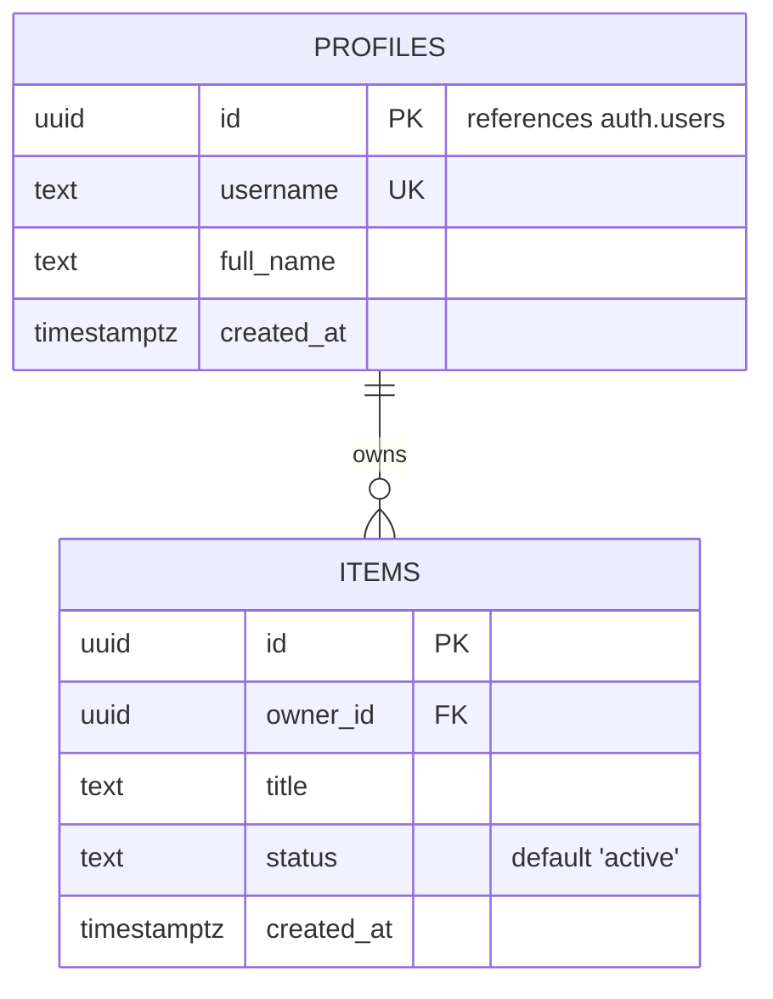

# <% tp.file.title %> — Data Model

> Single source of truth for this app's Supabase/Postgres schema.
> The coding agent reads this verbatim to generate tables, RLS policies, and migrations.

## Entity-Relationship Diagram

## Tables
### `profiles`
| Column | Type | Constraints | Notes |
|--------|------|-------------|-------|
| id | uuid | PK, references `auth.users(id)` | mirrors Supabase auth user |
| username | text | unique, not null | |
| full_name | text | | |
| created_at | timestamptz | default `now()` | |

### `items`
| Column | Type | Constraints | Notes |
|--------|------|-------------|-------|
| id | uuid | PK, default `gen_random_uuid()` | |
| owner_id | uuid | FK -> `profiles(id)`, not null | |
| title | text | not null | |
| status | text | default `'active'` | |
| created_at | timestamptz | default `now()` | |

## Row-Level Security (RLS)
- **`profiles`** — RLS on. A user may `select` any profile; may `update` only `where id = auth.uid()`.
- **`items`** — RLS on. A user may `select/insert/update/delete` only `where owner_id = auth.uid()`.

## Indexes
- `items(owner_id)`
- `items(status)` if filtering by status.

## Triggers / Functions
- On new `auth.users` row, insert a matching `profiles` row (Supabase handle-new-user trigger).
