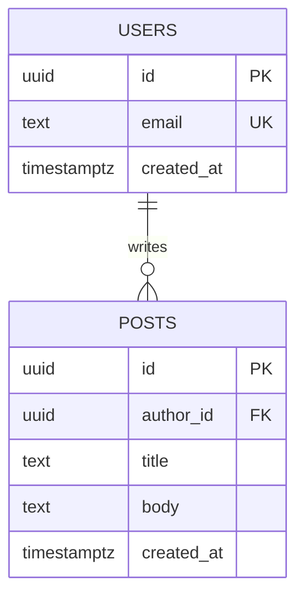

# <% tp.file.title %>

## Problem Statement
<!-- What user/business problem does this solve? Be specific and concrete. -->

## Solution Overview
<!-- The feature in 2-4 sentences. Note Server Components vs Client Components where relevant. -->

## User Stories
- **US1:** As a [role], I want [action] so that [benefit].
- **US2:** As a [role], I want [action] so that [benefit].

## Technical Requirements

### Data model (Supabase / Postgres)
<!-- Name the EXACT tables. Add RLS intent + indexes the diagram can't show. -->

- **RLS:** `posts` — authenticated users may `select` all; may `insert/update/delete` only where `author_id = auth.uid()`.
- **Indexes:** `posts(author_id)`.

### Auth
<!-- Supabase Auth flow: provider(s), session handling, protected routes. -->

### API / Routes
| Route | Method | Auth | Description |
|-------|--------|------|-------------|
| `/api/posts` | GET | public | List posts |
| `/api/posts` | POST | required | Create a post |

## Acceptance Criteria
**US1**
- Given an authenticated user, When they submit a valid post, Then it is inserted with `author_id = auth.uid()` and returns 201.
- Given an unauthenticated user, When they POST `/api/posts`, Then the request is rejected with 401.
- Given a title longer than 200 chars, When submitted, Then validation fails with a field-level error.

## Constraints / Non-negotiables
- Must use Supabase Auth (no custom auth).
- Server Components for data fetching; Client Components only for interactivity.

## Related docs
- [Data model](./db-schema.md)
